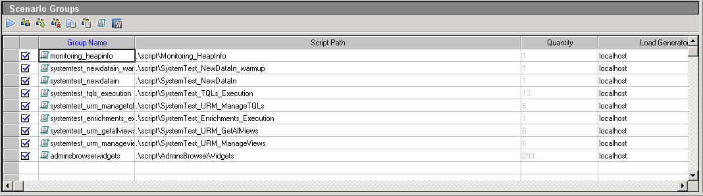

# Benchmarking

## System Benchmark Testing Scenarios

The UCMDB system benchmark testing lasts 8 hours including

*	Data-in: "1 data-in user". Each data-in user performs insert of bulk of 10K CIs 1 time, then update of those 10K CIs 3 times and then delete of 10K CIs.
*	Enrichment: "1 enrichment user". Each enrichment user performs insert-update-delete of 3K CIs, in the interval of each operation is 15 minutes.
*	TQL calculation: "13 TQL users". Each user calculates 10 TQLs in interval of 100 seconds and then saves and deletes TQLs each 30 seconds.
*	View: "6 view users". Each user saves and deletes views each 30 seconds, gets all views each 1 minute.

The UCMDB Browser testing scenario
* Login
* Search for 5 times
* Navigate to searched results after each search
* Navigate 2 widgets after navigation to searched results

The intervals between the operations are either 5 seconds( view and navigate) or 30 seconds(other operations)

Here is the screenshot of LoadRunner testing scenario

We can see, in "**Scenarios Groups**" windows, there is 8 scripts. The script "systemtest-newdata-in-warmup" will be executed firstly. After this script finished, The rest of the scripts will be executed and ran for 8 hours.

* "Monitoring_HeapInfo" is the script to minitoring the UCMDB java heap usage durning the test

## How to change the concurrent user number and running duration?
After you select any group in "Scenario Groups" Window. You can see a "**Scenario Schedule**" Window listed blow.

* "Start Vusers" - Change the concurrent user number
* "Duration" - Change the running duration

