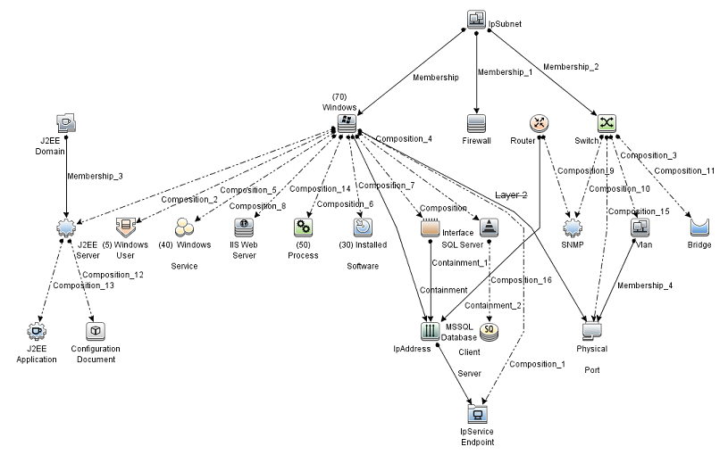

# Population
The population is created using UCMDB java API and is run via LR java protocol.  UCMDB consists of CIs and links between those CIs.
For our basic system test population, we create around 14 million CIs and links that consists of the following topology:

The above topology is created 701 times (For 14 million CI population) and is differentiated with different subnets (See ipSubnet “root” at the top of the of the above topology illustration).
Apart from the different ipSubnet, we also mark each million CI with a number, we use this number in our system test which will be explained later 

