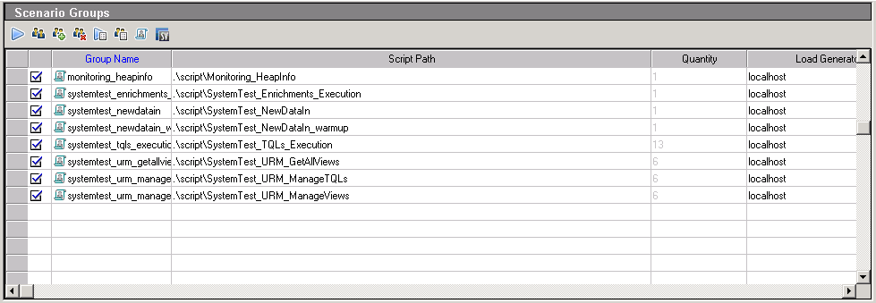
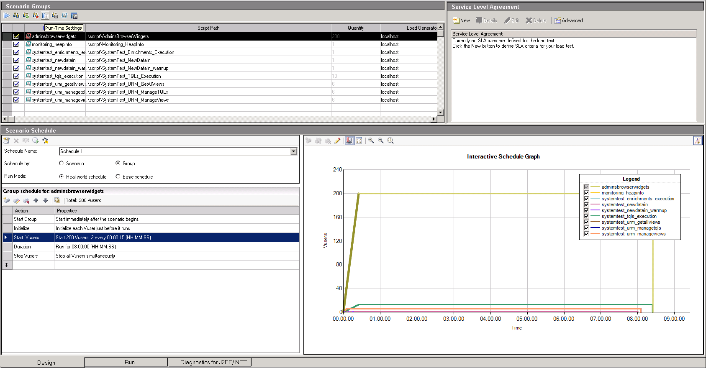
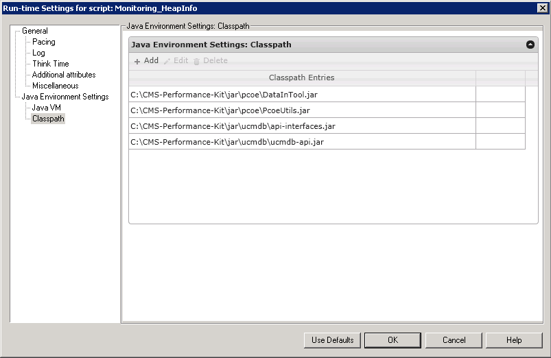
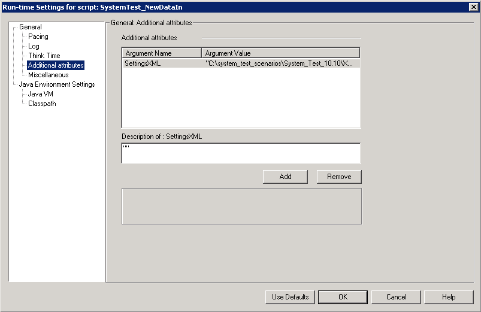
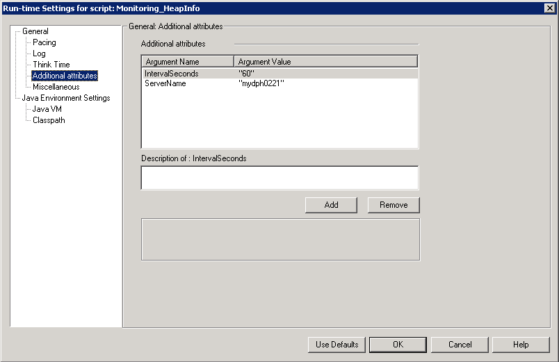
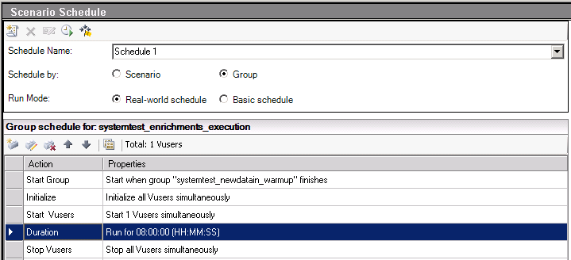
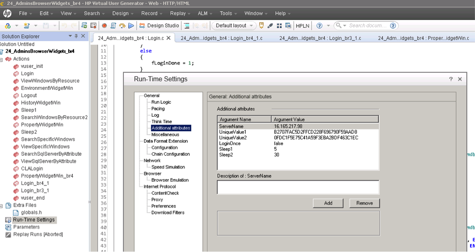

# System Benchmark Testing Scenarios

The UCMDB system benchmark test's duration i8 hours. The benchmark test includes,

*	**Data-in**: "1 data-in user". Each data-in user performs insert of bulk of 10K CIs 1 time, then update of those 10K CIs 3 times and then delete of 10K CIs.
*	**Enrichment**: "1 enrichment user". Each enrichment user performs insert-update-delete of 3K CIs, in the interval of each operation is 15 minutes.
*	**TQL calculation**: "13 TQL users". Each user calculates 10 TQLs in interval of 100 seconds and then saves and deletes TQLs each 30 seconds.
*	**View**: "6 view users". Each user saves and deletes views each 30 seconds, gets all views each 1 minute.

The UCMDB Browser testing scenario are listed blow:
* Login
* Search for 5 times
* Navigate to searched results after each search
* Navigate 2 widgets after navigation to searched results

The intervals between the operations are either 5 seconds( view and navigate) or 30 seconds(other operations)


Here is the screenshot of LoadRunner testing scenario



We can see, in "**Scenarios Groups**" windows, there is 8 scripts. The script "systemtest-newdata-in-warmup" will be executed firstly. After this script finished, The rest of the scripts will be executed and ran for 8 hours.

* "Monitoring_HeapInfo" is the script to minitoring the UCMDB java heap usage durning the test


## How to change the xml settings
open the settings.xml under "xml" folder. change the following characters
* ServerName - replace it to your testing UCMDB Server
* INI - replace it to your ini location
* MailOnFail - replace to your email


## How to change the runtime settings

Before running the performance test, you have to change some run-time settings in the "LoadRunner Controller"'s design pannel. Double click each scripts and right click the button and goto the "Run-Time Settings"



You have to config the classpath and the xml setting for the following scripts
* SystemTest_EnrichmentsExectution
* SystemTest_NewDataIn
* SystemTest_NewDataInWarmup
* SystemTest_TQLsExection
* SystemTest_URMGetAllViews
* SystemTest_URMManageTQLs
* SystemTest_URMManageViews

Classpath setting


XML settings



You have to configure the "ServerName" for the script "monitoring_HeapInfo"



## How to change the concurrent users and running duration?
After you select any group in "Scenario Groups" Window. You can see a "**Scenario Schedule**" Window listed blow.



* "Start Vusers" - Change the concurrent user number
* "Duration" - Change the running duration


Change the runtime setting


## How to modify browser load runner scripts

1. Record load runner login script with browser server in your test environment.
2. Find two string values marked in yellow in script you recorded.
```
lr_start_transaction("Browser_Login");

        web_custom_request("ucmdb_browser.rpc_2",
        "URL=http://{lrServerName}:8088/ucmdb-browser/ucmdb_browser/ucmdb_browser.rpc",
        "Method=POST",
        "Resource=0",
        "RecContentType=application/json",
        "Referer=http://{lrServerName}:8088/ucmdb-browser/ucmdb_browser.jsp",
        "Snapshot=t5.inf",
        "Mode=HTML",
        "EncType=text/x-gwt-rpc; charset=utf-8",
        "Body=7|0|9|http://{lrServerName}:8088/ucmdb-browser/ucmdb_browser/|{lrUniqueValue1}|com.hp.ucmdb_browser.shared.UcmdbBrowserService|login|java.lang.String/2004016611|J|Z|admin|Default Client|1|2|3|4|5|5|5|5|6|7|8|8|9|P__________|0|",
        LAST);

    web_custom_request("ucmdb_browser.rpc_3",
        "URL=http://{lrServerName}:8088/ucmdb-browser/ucmdb_browser/ucmdb_browser.rpc",
        "Method=POST",
        "Resource=0",
        "RecContentType=application/json",
        "Referer=http://{lrServerName}:8088/ucmdb-browser/ucmdb_browser.jsp",
        "Snapshot=t6.inf",
        "Mode=HTML",
        "EncType=text/x-gwt-rpc; charset=utf-8",
        "Body=7|0|4|http://{lrServerName}:8088/ucmdb-browser/ucmdb_browser/|{lrUniqueValue1}|com.hp.ucmdb_browser.shared.UcmdbBrowserService|getUCMDBUserLocale|1|2|3|4|0|",
        EXTRARES,
        "Url=deferredjs/{lrUniqueValue2}/20.cache.js", "Referer=http://{lrServerName}:8088/ucmdb-browser/ucmdb_browser.jsp", ENDITEM,
        "Url=deferredjs/{lrUniqueValue2}/1.cache.js", "Referer=http://{lrServerName}:8088/ucmdb-browser/ucmdb_browser.jsp", ENDITEM,
        LAST);
        ```

3. Open browser script in virtual user generator, and edit its run-time settings. Replace attributes value of UniqueValue1 and UniqueValue2 with new values got in step

4. Replace server name with your browser server name.
5. Run the script and validate.
6. If login still failed, you can record login action and replace existing login script with new one.


