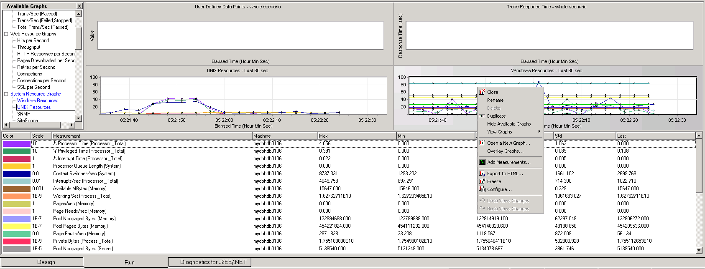

# How to add performance counter

### LoadRunner performance monitoring ovewview
You use LoadRunner's System Resource monitors to monitor a machine's system resource usage during a scenario run and isolate server performance bottlenecks.
A primary factor in a transaction's response time is its system resource usage. Using the LoadRunner resource monitors, you can monitor the Windows, UNIX, Server, SNMP, FireWall server, and SiteScope resources on a machine during a scenario run, and determine why a bottleneck occurred on a particular machine.
The resource monitors are automatically enabled when you execute a scenario. However, you must specify the machine you want to monitor and which resources to monitor for each machine. You can also add or remove machines and resources during the scenario run.

### How to add performance counter in loadrunner
Drug the "System Resource Graphs" tp the right pannel. Then right click the mouse button. Click the "add measurements" to add the performance counters as you like.

