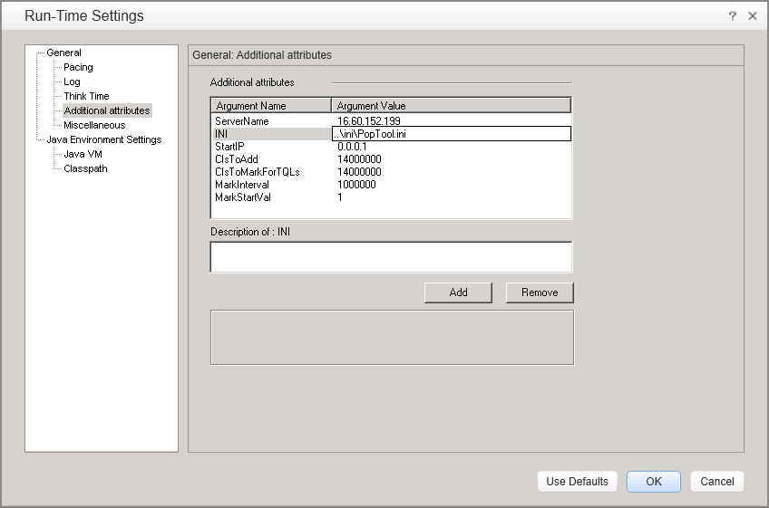
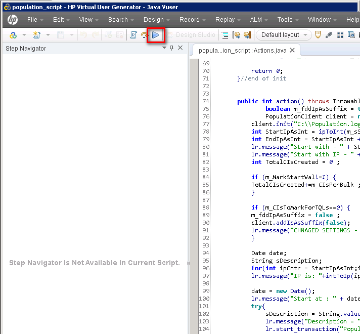

# Software Requirement
## HP LoadRunner
You can download LoadRunner 11.52 from the link listed blow:
https://h20575.www2.hp.com/evalportal/displayProductsList.do?prdcenter=HPSS_PC

## JDK
Since the LoadRunner 11.52 use the "Java Protocal", so you have to install the JDK 1.7 32bit version.

If you use the rest of JDK versions, it might ran into some issue.

# Hardware recommendation for test environment
Here is the UCMDB hardware recommendation for enterprise deployment

| Usage | CPU | RAM | Storage(free space)|
| -- | -- | -- | -- |
| UCMDB Server | 24 Cores  | 32 GB | 50G  |
| UCMDB Browser | 12 Cores | 16 GB | 10 GB |
| Oracle Database | 24 Cores | 64 GB | 500G  |
| HP LoadRunner | 12 Cores | 16 GB | 10 GB |

# How to prepare the testing data
### Deploy the package in UCMDB

We need to create the TQL and Enrichment in UCMDB server for the performance test.
1. Go to the UCMDB admin UI, goto
**Managers->Administration->Package Manager > Deploy package to Server**

2. Select the file "system-test-enrichments-tqls.zip" under the "package" folder of CMS performance kit.

### Data Population

In order to run the performacne test, we need to parepare the testing data for the test.

Open the LoadRunner Script under "population" folder. Open the "population_script.usr" in LoadRunner vUgen.

In LoadRunner Virtual User Generator, go to "Replay" -> "Run-Time Settings"

1. Change value of "CIsToAdd". For example, we can use "14000000" to populat 14M CIs + relationships
2. Change the value "ini". Use the file under "pupulation/ini"

### JVM Settings for loadRunner
In the Run-time Setting" pannel, clienck the "Classpath" to add the following jars into the classpath
* jar/pcoe/DataTool
* jar/pcoe/PcoeUtils.jar
* jar/ucmdb/api-interfaces.jar
* jar/ucmdb/ucmdb-api.jar

### Populate the testing data
In the LoadRunner VUGen, Click the "Reply" button to execute the test

